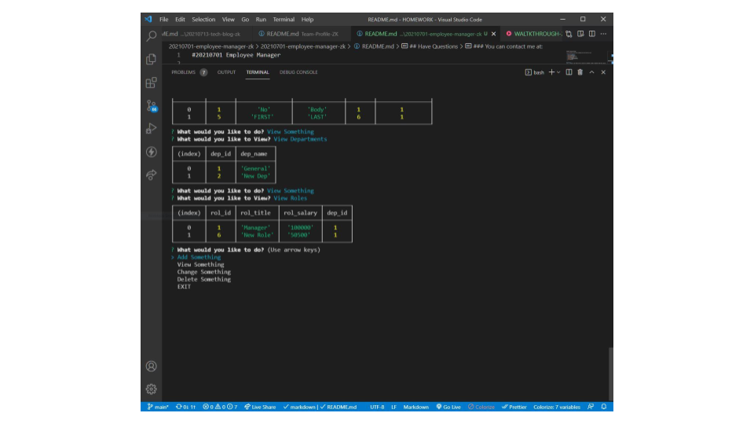

#20210701 Employee Manager


 ## Table of Contents.
 * [Overview](#overview)
 * [Design](#overview)
 * [Installation](#overview)
 * [Usage](#overview)
 * [Criteria](#given-criteria)
 * [Questions](#have-questions)
 * [Links](#links)
 ---


## Overview 
This is a project i was tasked to build a solution for managing a company's employees using node, inquirer, and MySQL.

## Design


The UI was runs through the users terminal, default answers are provided as examples of what to enter.

## Installation Instructions
Install node and the following with npm install; inquirer and mysql2.

## Usage Instructions
After installing npms, use node to launch the app.js, follow the prompts as needed.


---
## Given Criteria
Build a command-line application that at a minimum allows the user to:

  * Add departments, roles, employees

  * View departments, roles, employees

  * Update employee roles

  
* Use the [MySQL](https://www.npmjs.com/package/mysql) NPM package to connect to your MySQL database and perform queries.

* Use [InquirerJs](https://www.npmjs.com/package/inquirer/v/0.2.3) NPM package to interact with the user via the command-line.

* Use [console.table](https://www.npmjs.com/package/console.table) to print MySQL rows to the console. There is a built-in version of `console.table`, but the NPM package formats the data a little better for our purposes.


---
## Have Questions
### You can contact me at:

GITHUB: <https://github.com/ZacharyWK>

EMAIL: <ZachKrause@live.com>


---
## Links
[REPOSITORY](https://github.com/ZacharyWK/20210701-employee-manager-zk)
```
https://github.com/ZacharyWK/20210701-employee-manager-zk
```

[WALKTHROUGH](https://youtu.be/CnG-ZrOhBlM)
```
https://youtu.be/CnG-ZrOhBlM
```